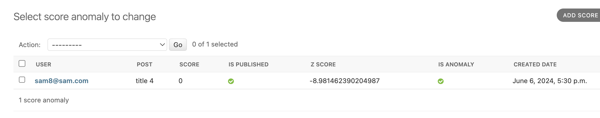

# Bitpin Test

Below is the description of the endpoints and a sample of posts' score fraud guard.

# TL;DR

- **user signup:** `POST /api/v1/user/signup/`
- **user login:** `POST /api/v1/user/login/`

As the performance matters, during the task I had three different approaches to develop the **post-list** endpoint, so I
keep the all three approaches, keep the load-test history and provided at the bottom of readme. so:

- **posts list v1:** `GET /api/v1/blog/post-list/`
- **posts list v2:** `GET /api/v1/blog/post-list-annotation/`
- **posts list v3:** `GET /api/v1/blog/post-list-optimized/`

  to store the score for posts:
- **post score:** `POST /api/v1/blog/post-score/<str:post_id>`

  to set settings for posts' score fraud guard
- **score fraud setting:** `POST /api/v1/blog/score-fraud-setting/<str:post_id>`

  the endpoint with the enabled fraud guard (below endpoint is the fraud guard enabled version of **post score**
  endpoint):
- **post score fraud enabled(fe):** `POST /api/v1/blog/post-score-fe/<str:post_id>`
- **check z-score**
## Installation
- clone code
- use below keys and make .env file in the /bitpin/bitpin/ directory
  - `DATABASE_NAME=
DATABASE_USER=
DATABASE_PASS=
DATABASE_HOST=
PORT=
REDIS_LOCATION=redis://
CELERY_BROKER_URL=
CELERY_RESULT_BACKEND=`

- `pip install requirements.txt`
- `python manage.py makemigrations`
- `python manage.py migrate`
- `python manage runserver`
- `python manage.py createsuperuser`
- make "post" instance from admin panel
- ensure redis server is up and running
- ensure celery worker is working using:`Celery -A bitpin worker -l info `
- ensure celery-beat worker is working using:`Celery -A bitpin beat -l info`
- in the production mode the last two bullets will be systemd services


## Apps

### 1. User app(considered as the out of scope but needed for the Blog app):

Authorization using JWT  

- **user signup:** `POST /api/v1/user/signup/`
    - sample input:

```json
{
  "email": "sam@sam.com",
  "first_name": "sam",
  "last_name": "pb",
  "password": "sam", # out of scope, no OTP, no strict rules
  "password_confirmation": "sam"
}
```

- **user login:** `POST /api/v1/user/login/`
    - sample input:

```json
{
  "email": "sam@sam.com",
  "password": "sam"
}
```

### 2. Blog app

all requests need a header as below:

```
Authorization: Bearer <token>
```

- **posts list v1:** `GET /api/v1/blog/post-list/`
- **posts list v2:** `GET /api/v1/blog/post-list-annotation/`
- **posts list v3:** `GET /api/v1/blog/post-list-optimized/`

    - all versions have the same result with different performance (benchmark at the bottom of page).  
  sample response:

```json
"count": 4,
"next": null,
"previous": null,
"results": [
{
"id": "e1415852-f33a-4dac-82a4-debf4ad754e9",
"title": "title 4",
"content": "lorem ipsum 4",
"score_count": 1,
"score_avg": 5.0,
"my_score": 5
},
{
"id": "8927c536-5446-4e36-8d38-59be604ae49d",
"title": "title 3",
"content": "lorem ipsum 3",
"score_count": 6,
"score_avg": 2.1666666666666665,
"my_score": 3
},
{
"id": "4b42b88e-f47c-4468-8a89-e26b25ce0e0c",
"title": "title 2",
"content": "lorem ipsum 2",
"score_count": 0,
"score_avg": null,
"my_score": null
},
{
"id": "5477a918-bec9-4945-ab11-89f044db803d",
"title": "title 1",
"content": "lorem ipsum 1",
"score_count": 0,
"score_avg": null,
"my_score": null
}
]

```

- **post score:** `POST /api/v1/blog/post-score/<str:post_id>`  
  *to store score*
- sample input:

```json
{
  "score": 1
} 
```
## Score Fraud Guard 
It has two main parts:  

1- live mechanism to prevent users using specific scores in a window of time: 
  - there is an endpoint to save settings for each post
    - `time_window:` time duration (minutes)
    - `forbidden_scores:` forbidden scores that need to restrict
    - `score_count_limit:` limit for forbidden scores count
 
- there is another endpoint to get the score from user, then 
check user entered score and the count of stored scores in the time_window

2- A background task to check z-score of last 30mins scores and compare to the last 24h scores
### Explanation
In general, in toxic user engagement, not only
zero scores are significant, but extreme scores (0, 5)
are also vital. Additionally, the count of scores stored
for a post is important too.

The system should be intelligent and flexible enough
to distinguish between a newly published post with
many impressions in a small time window and an old
post. Therefore, there are many parameters to diagnose 
a score as an anomaly.

To simplify the problem and adopt a flexible approach,
I implemented a system that first enables the firm
to enforce rules for specific posts. When a user tries
to save a score for a
post, the system calculates the count of forbidden scores
stored in the last time window. If this count
exceeds the limit, it returns the proper message to
the user and does not store the score. while it is restricted for specific
scores, the other scores is active without limits.

By using this method, we can spread user engagement 
through the day. While this involves a manual operation performed
by the admin for a post, it provides great flexibility 
for different posts at various stages and enables the
organization to enforce rules to protect posts from
score manipulation.
#### pros:
- not I/O intensive
- live result
- flexible
- can handle multiple scenarios for a post
- can set settings for posts independently
- can edit the settings every time needed on the fly
#### cons:
- manual operation to set the settings for posts
- not so intelligent
- probability of miss real scores
- preventing users to use specific scores  


- **score fraud setting:** `POST /api/v1/blog/score-fraud-setting/<str:post_id>`  
  *the data will created or updated in case of there has been record of settings for the specific post.*
  sample input:

```json
{
  "time_window": 20,
  "forbidden_scores": [0, 1, 5],
  "score_count_limit": 30
}
```

**case explanation:**  
in this case if the count of forbidden scores (0,1,5) in the last 20 mins for a specific post exceeds 30, It will not store any forbidden scores (0,1,5) anymore till the time window passes and the count of forbidden
scores be less than 30.
**during the restrictions the other scores (2,3,4) are accepted with no limit.**
- **post score fraud enabled(fe):** `POST /api/v1/blog/post-score-fe/<str:post_id>`   
*it stores the score through fraud guard logic*
- sample input:

```json
{
  "score": 0
}
```

in case of exceeds the limits the response will be:

```json
{
    "message": "currently not available, please try again later"
}
```

### Check Z-Score:
A celery background task scheduled every 30 mins fetch all scores that stored in the last 30 mins then determined the corresponding posts,
after that z-score of each new scores calculated and compared with the z-score of 
last 24h scores, if it exceeds the threshold (normally 2) it is recognized as an "outlier" and stored in the ScoreAnomalyModel
with an "anamoly" label.
<div style="display: grid; justify-content: space-around;">
  
</div>

Now we could automatically exclude the scores with anomaly labels or develop
an endpoint that admin checks manually and does what is needed.

sample:   
last_24_scores = [2, 4, 5, 3, 4, 3, 4, 3, 4, 5, 4, 2, 3, 4, 2, 3, 4, 5, 4, 4, 5, 4, 5, 4, 5, 4, 3, 4, 3, 4, 3, 4]  
last_30mins_score = [3, 4, 3, 4, 5, 4, 3, 4, 1, 0, 0, 0, 0, 0, 0]  
threshold = 2  
the outliers will be: [1, 0, 0, 0, 0, 0, 0]
<br>
### pros:
- more automated approach
- more intelligent solution
- not preventing users to save their scores
### cons:
- delayed result
- may miss the real scores
- more queries on background
- users may save their scores then after 30 mins they miss their scores

</br>


# Benchmark

Below pictures are the debug toolbar view and depict the number of query for each post-list endpoints, the **post-list-optimzed** endpoint has
the best performance between the three different approaches.
<div style="display: flex; justify-content: space-around;">
  

  
  
</div>

also the load-test has been done using 17 workers of Gunicorn (2*cores+1) on the same condition without caching:
```python
gunicorn -w 17 -b 127.0.0.1:8000 bitpin.wsgi:application
```

<div style="display: grid; justify-content: space-around;">
  
</div>


<div style="display: grid; justify-content: space-around;">
  
  
  
</div>

`/api/v1/blog/post-list/` ~ 130 req/s, 440 ms avg response time  

`/api/v1/blog/post-list-annotation/`~ 193 req/s, 287 ms avg response time  

`/api/v1/blog/post-list-optimized/`~ 261 req/s, 168 ms avg response time  

based on the metrics above, the third method choosed and set cache and cache invalidation. 


